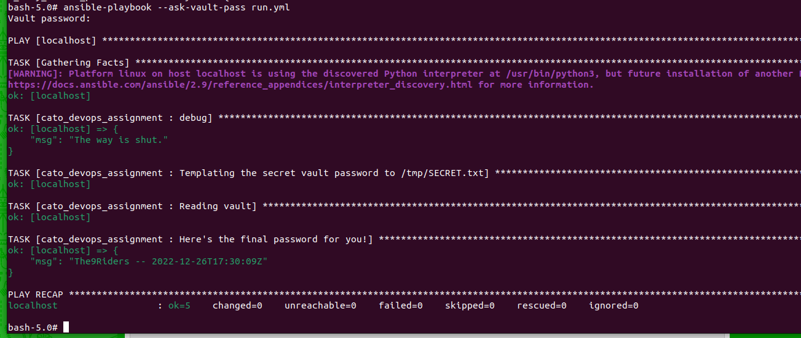

# Solution

1. YouSha11NotP@ass
   
   The first file to check when there is no internet connectivity is /etc/resolve.conf file (incharge of dns)
   I convertet the date using [this website](https://www.epochconverter.com/?prefs)
   
2. TheW1tchK1ng
   
   I ran the command `awk 'NR % 1000 == 0' linux_shell_puzzle.txt | cut -c1-1 | tr -d '\n'`

3. B@lrogOfMoria
   
   I ran the [this](script.py) file (bonus part is [this](bonus-script.py) file)

4. The9Riders
   
   I added the flag `--ask-vault-pass` and decoded from base64 the password in inventory/host_vars/localhost.yml
   Output is:
   
